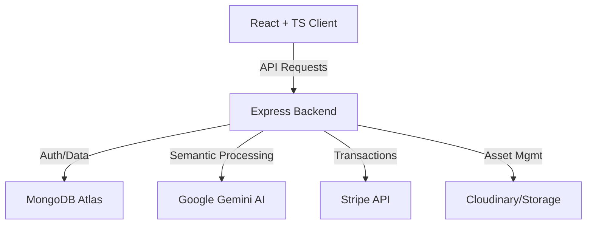

# MercatoX AI: Next-Generation E-Commerce Architecture 🚀

[](https://www.mongodb.com/mern-stack)
[](https://ai.google.dev/)
[](https://www.typescriptlang.org/)
[](./LICENSE)

MercatoX AI is a sophisticated, full-stack e-commerce ecosystem leveraging the power of Artificial Intelligence to redefine the online shopping experience. Designed as a high-performance MERN-stack application, it integrates semantic product search, multi-role management dashboards, and secure financial transactions.

---

## 📖 Table of Contents
- [Project Overview](#-project-overview)
- [Key Features](#-key-features)
- [Technical Stack](#-technical-stack)
- [System Architecture](#-system-architecture)
- [Gallery / Screenshots](#-gallery--screenshots)
- [Installation Architecture](#-installation-architecture)
- [API Documentation](#-api-documentation)
- [Future Horizons](#-future-horizons)
- [Legal & Ownership](#-legal--ownership)

---

## 🌟 Project Overview
MercatoX AI is engineered to bridge the gap between traditional keyword-based e-commerce and modern semantic intent. By utilizing advanced AI embeddings, the platform understands *what* a user wants, even if the keywords don't match exactly. The system is built on a distributed micro-services-lite architecture, ensuring scalability for both buyers and sellers while maintaining a centralized administrative control center.

---

## 🛠 Key Features

### 🤖 AI-Powered Intelligence
- **Semantic Product Search**: Beyond basic keywords; uses vector embeddings to understand product context.
- **Smart Recommendations**: Personalized product discovery powered by Gemini AI.
- **AI Analytics**: Predictive insights for vendors regarding product performance.

### 👥 Multi-Role Ecosystem
- **Secure Admin Command Center**: Global oversight of users, products, and financial health.
- **Vendor (Seller) Dashboard**: High-fidelity product management, inventory tracking, and sales analytics.
- **Sophisticated Buyer Experience**: Wishlist management, shopping cart, and transaction history.

### 🛡 Security & Reliability
- **Proprietary IP Protection**: Built-in deterrents against unauthorized code inspection and content scraping.
- **JWT Authentication**: Secure, stateless authentication with specialized route protection.
- **Stripe Integration**: Industry-standard secure payment processing.

---

## 💻 Technical Stack

### **Frontend Architecture**
- **React 18 & TypeScript**: For type-safe, component-driven development.
- **Vite**: Ultra-fast build tool and development server.
- **Tailwind CSS**: Modern utility-first styling for a premium UI.
- **Lucide React**: High-quality iconography.

### **Backend Infrastructure**
- **Node.js & Express.js**: High-performance asynchronous API server.
- **MongoDB Atlas**: Highly-scalable NoSQL database for flexible data modeling.
- **Mongoose**: Elegant Object Data Modeling (ODM) for Node.js.

### **Third-Party Integrations**
- **AI Engine**: Google Gemini API (Representational Embeddings).
- **Payment Gateway**: Stripe API.
- **State Management**: React Context API & Hooks.

---

## 🏗 System Architecture

The MercatoX ecosystem follows a tiered architecture designed for separation of concerns and maximum data integrity:

1.  **Presentation Tier (Frontend)**: React client interacts with the RESTful API via specialized service wrappers.
2.  **Logic Tier (Backend)**: Express controllers manage business logic, authentication, and external service coordination.
3.  **Intelligence Tier (AI)**: Google Gemini processes semantic queries and generates high-dimensional embeddings.
4.  **Data Tier (Database)**: MongoDB Atlas stores relational-like e-commerce data (Users, Products, Orders).



---

## 📂 Folder Structure

```text
/
├── client/                 # Frontend environment (Vite/React)
│   ├── src/
│   │   ├── components/    # Reusable UI elements
│   │   ├── context/       # Auth & Cart Global State
│   │   ├── layouts/       # Main, Auth, & Dashboard Layouts
│   │   ├── pages/         # High-level route components
│   │   ├── services/      # API communication layer
│   │   └── types/         # Global TypeScript definitions
│   └── index.html         # Application root with SEO metadata
│
├── server/                 # Backend environment (Node/Express)
│   ├── config/            # DB, Socket, and Env configurations
│   ├── controllers/       # Business logic handlers
│   ├── middleware/        # Protection & Logging layers
│   ├── models/            # Mongoose schemas (Product, User, Order)
│   ├── routes/            # API endpoint definitions
│   └── server.js          # Main entry point
│
└── LICENSE                # Proprietary IP documentation
```

---

## 🚀 Installation Architecture

### **Prerequisites**
- Node.js (v18.x or higher)
- MongoDB Atlas Account
- Gemini API Key
- Stripe API Keys

### **1. Repository Initialization**
```bash
git clone https://github.com/your-repo/mercatox-ai.git
cd mercatox-ai
```

### **2. Backend Configuration**
```bash
cd server
npm install
touch .env
```
Add the following configuration:
```env
PORT=5000
MONGODB_URI=your_mongodb_atlas_uri
JWT_SECRET=your_super_secret_key
GEMINI_API_KEY=your_gemini_api_key
STRIPE_SECRET_KEY=your_stripe_secret_key
```

### **3. Frontend Configuration**
```bash
cd ../client
npm install
```

### **4. System Execution**
```bash
# In the root or server directory
npm run dev
```

---

## 📡 API Documentation Summary

| Method | Endpoint | Description |
| :--- | :--- | :--- |
| **POST** | `/api/v1/auth/signup` | Register new User role (Buyer/Seller) |
| **POST** | `/api/v1/auth/login` | Authenticate and retrieve JWT |
| **GET** | `/api/v1/products` | Retrieve all products (supports semantic query) |
| **POST** | `/api/v1/products` | [Sellers Only] Add new inventory |
| **POST** | `/api/v1/cart` | Modify buyer shopping cart |
| **POST** | `/api/v1/payments/create` | Initiate secure Stripe checkout |

---

## 📸 Gallery / Screenshots
*(Placeholders for visual documentation)*
- `[Screenshot 1: AI Search Demo]`
- `[Screenshot 2: Admin Command Center]`
- `[Screenshot 3: Vendor Inventory Hub]`
- `[Screenshot 4: Hero Section & Modern Homepage]`

---

## 🗺 Future Horizons
- **Mobile Native Expansion**: Dedicated iOS/Android applications using React Native.
- **Live AI Sales Assistant**: Integrated chatbot for real-time buyer negotiation.
- **Advanced Predictive Logistics**: AI-modeled shipping and stock replenishment notifications.
- **Global Multi-Vendor scaling**: Enhanced sub-domain support for independent sellers.

---

## 📜 Legal & Ownership

**Owner: MercatoX Operations**
**Copyright © 2026**
**All Rights Reserved.**

This software and design are the intellectual property of the owner and may not be copied, modified, distributed, or used without explicit permission. Unauthorized copying of this file or system is strictly prohibited.

---
*Built with ❤️ by the MercatoX Engineering Team.*
